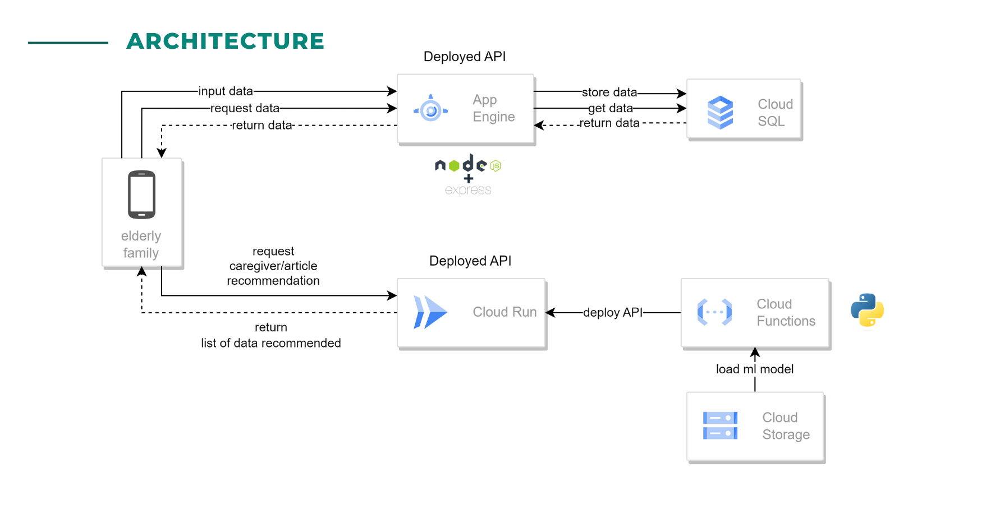

  

# Cloud-Computing
Cloud Computing Repository for CS23-PS276 Bangkit Capstone Project "Sahabat Lansia"

  

### The Service Available:
* Authentication
  <pre>POST /register</pre>
  <pre>POST /login</pre>
* Users
  <pre>PUT /users/:xid</pre>
  <pre>GET /users</pre>
  <pre>GET /users/:xid</pre>
  <pre>DEL /users/:xid</pre>
* Lansia
  <pre>POST /lansia</pre>
  <pre>GET /lansia?showAll=true  </pre>
  <pre>GET /users/:xid</pre>
  <pre>DEL /users/:xid</pre>
  
## How to use

* **Clone into your local repository** 
  <pre>git clone {{the repository link}}</pre>
* **Instal all dependecies** 
  Open the folder in VSC or any code editor and then open the terminal and run this command
  <pre>npm i</pre>
* **Config all environment** 
  Open the file .env.example and copy all the code there and create new file named *.env* and paste all the code you copied before 
  the configuration will look like the following
  <pre>
  NODE_ENV=
  KEY=
  JWT_KEY=
  XID_LENGTH=
  BYCRIPT_ROUND=
  DB_USER=
  DB_PASS=
  DB=
  HOST=
  DIALECT=
  DB_PORT=
  CLIENT=
  PORT=
  JWT_ACCESS_LIFETIME=
  </pre>
  input all the configuration field
* **Create the database** 
  To create the database you just have to run this command
  <pre>npm run db:setup</pre>
* **Start service** 
  If you already setup the environment, copy this command and run it in your terminal
  <pre>npm start</pre>
  
**if you don't find an error, it means that the API ready to use**
